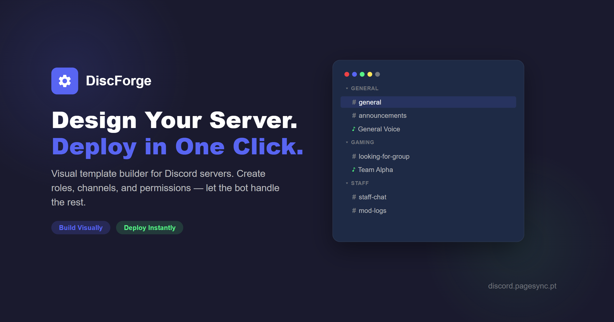
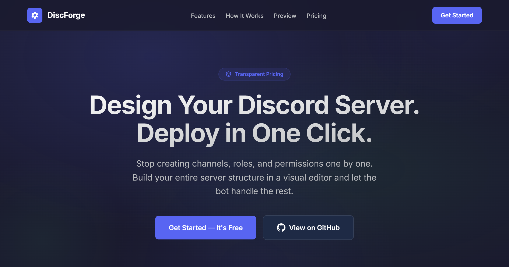
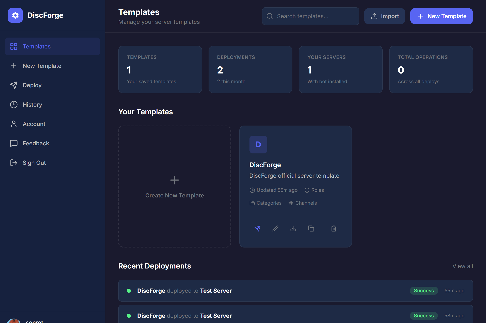
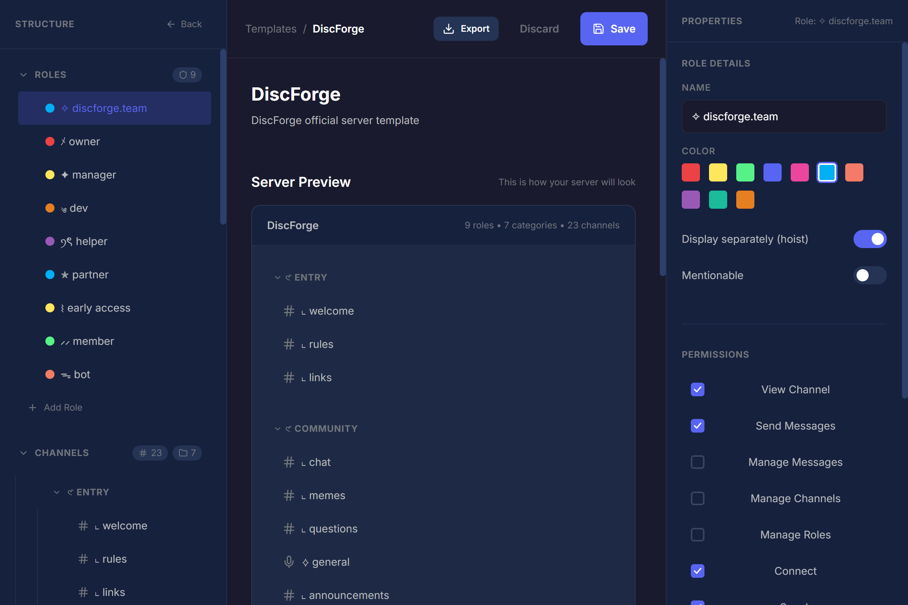
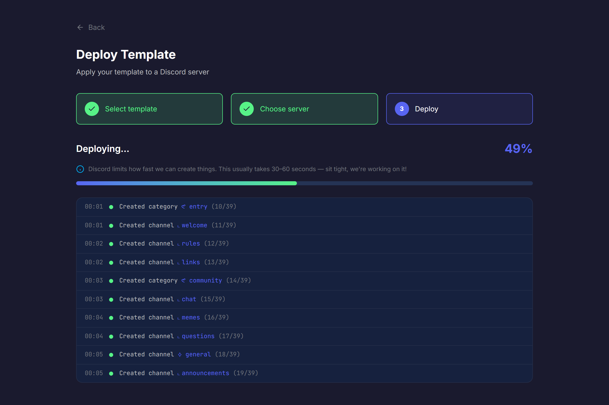
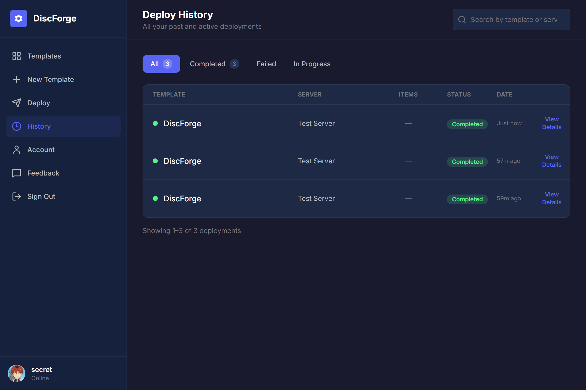
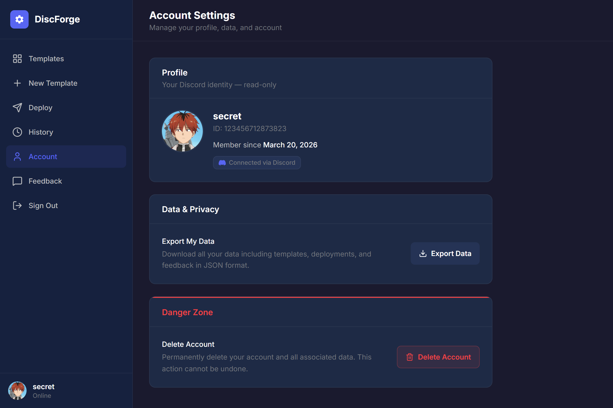

  

<h1 align="center">DiscForge</h1>

  <strong>Design your Discord server visually. Deploy with one click.</strong>

  <a href="https://discforge.pt">Website</a> &middot;
  <a href="https://waitlist.pagesync.pt">Join Waitlist</a>

---

## What is DiscForge?

DiscForge is a web application that lets you design Discord server structures — roles, categories, channels, and permissions — in a visual editor, then deploy them to any Discord server with a single click.

No more creating channels one by one. No more setting permissions manually. Build your template, hit deploy, and let the bot handle the rest.

## Features

- **Visual Template Builder** — 3-panel editor for roles, categories, text/voice channels, and permission overwrites
- **One-Click Deploy** — Select a server, press deploy, watch it happen in real time
- **Real-Time Progress** — WebSocket-powered live feed showing every step as the bot creates your server
- **Permission Management** — Set channel-level permission overwrites per role, private channels with one toggle
- **Save & Reuse** — Save templates, duplicate them, deploy to multiple servers
- **Drag & Drop** — Reorder roles, categories, and channels with drag-and-drop
- **Import/Export** — Encrypted template files (.discforge) for backup and sharing
- **Deploy History** — Full deployment log with details modal

## Screenshots

  
   <em>Landing Page</em>

  
   <em>Dashboard — Template Management</em>

  
   <em>Template Builder — 3-Panel Editor</em>

  
   <em>Real-Time Deploy Progress</em>

  
   <em>Deploy History</em>

  
   <em>Account Settings</em>

## Tech Stack

| Layer | Technology |
|-------|-----------|
| Frontend | React, Vite, TailwindCSS v4 |
| Backend | Node.js, Express, WebSocket |
| Bot | Discord.js v14 |
| Database | PostgreSQL |
| Cache/Queue | Redis |
| Containers | Docker, Docker Compose |
| Proxy/SSL | Nginx, Let's Encrypt |

## How It Works

1. **Sign in** with your Discord account
2. **Build** your server template — add roles, categories, channels, set permissions
3. **Deploy** to any server where you have admin permissions and the bot is present
4. **Watch** the bot create everything in real time

## Status

DiscForge is currently in **early access**. [Join the waitlist](https://waitlist.pagesync.pt) to get access.

## Author

Built by [@nunosantoss](https://github.com/nunosantoss)

---

  &copy; 2026 DiscForge. All rights reserved.

